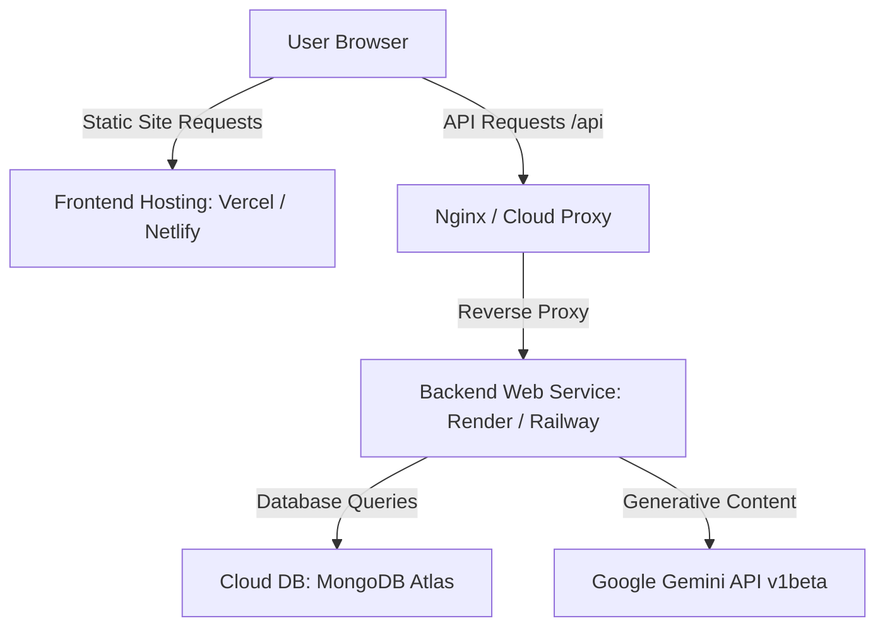

# Deployment Guide - AI-Powered Debt Management Platform

This document describes how to deploy the backend (Express & Node.js) and frontend (Vite & React) components of the application to production, using MongoDB Atlas for the cloud database.

---

## Architecture Overview



---

## Phase 1: Database Setup (MongoDB Atlas)

To move away from a local MongoDB server, use MongoDB Atlas (the cloud database service):

1. **Sign Up**: Create an account on [MongoDB Atlas](https://www.mongodb.com/cloud/atlas).
2. **Create a Cluster**: Spin up a free shared cluster (`M0 Sandbox`) in your preferred region.
3. **Configure Access Control**:
   - **Database User**: Create a user with read/write privileges (e.g., username `db_user` and a strong password).
   - **IP Whitelisting**: Allow access from `0.0.0.0/7` (any IP) for PaaS services like Render/Railway, or whitelist the static outbound IPs of your backend service.
4. **Retrieve Connection String**: Copy the URI connection string. It will look like:
   ```env
   mongodb+srv://db_user:<password>@cluster0.xxxx.mongodb.net/debt-guidance-db?retryWrites=true&w=majority
   ```

---

## Phase 2: Deploying the Backend (Express API)

Good hosting options for Node.js backend APIs include **Render**, **Railway**, and **Heroku**. Here are the instructions for **Render** (which has a free tier):

1. **Push Code to Git**: Ensure your codebase is pushed to a private or public repository on GitHub/GitLab.
2. **Create Render Web Service**:
   - Log in to [Render](https://render.com) and click **New > Web Service**.
   - Connect your GitHub repository.
3. **Configure Build Settings**:
   - **Root Directory**: `backend` (if deploying from a monorepo, otherwise blank).
   - **Build Command**: `npm install`
   - **Start Command**: `node server.js`
4. **Configure Environment Variables**:
   Add the following variables in the **Environment** tab:
   ```env
   PORT=10000
   NODE_ENV=production
   MONGO_URI=mongodb+srv://db_user:<password>@cluster0.xxxx.mongodb.net/debt-guidance-db?retryWrites=true&w=majority
   JWT_SECRET=YOUR_PRODUCTION_JWT_SECRET_STRING_HERE_KEEP_IT_SECURE
   JWT_EXPIRE=30d
   AI_PROVIDER=gemini
   GEMINI_API_KEY=AQ.Ab8RN6IfBF3ozXcvP83iY8_FrA-KFPXR34yTeplzIPmg6mt8zA
   ```
5. **Deploy**: Render will build and deploy your service, exposing a public URL (e.g., `https://debt-guidance-api.onrender.com`).

---

## Phase 3: Deploying the Frontend (Vite & React)

Since the frontend is a static SPA built with Vite, it can be hosted for free on **Vercel**, **Netlify**, or **Render Static Sites**.

### 1. Update Proxy Configuration for Production
In development, the Vite dev server proxies `/api` to `http://localhost:5000`. In production, static hosting providers do not run a dev server proxy. Instead, you should adjust the Axios config to target the production backend URL directly.

In `frontend/src/api/client.js`, change the client initialization:
```javascript
import axios from 'axios';

// Detect if we are in production or local development
const isProd = import.meta.env.PROD;
const backendURL = isProd 
  ? 'https://your-backend-api-url.onrender.com' // Replace with your Render URL
  : ''; 

const client = axios.create({
  baseURL: backendURL,
  headers: {
    'Content-Type': 'application/json'
  }
});
```

### 2. Configure CORS in the Backend
Make sure the backend is configured to accept requests from your production frontend domain (e.g. `https://your-frontend-site.vercel.app`).
In your backend's CORS configuration (usually in `backend/src/app.js`), whitelist your frontend domain.

### 3. Deploy to Vercel/Netlify
1. Log in to [Vercel](https://vercel.com).
2. Click **Add New > Project**, and select your GitHub repository.
3. **Configure Framework Settings**:
   - Vercel automatically detects the Vite framework.
   - **Root Directory**: `frontend`
   - **Build Command**: `npm run build`
   - **Output Directory**: `dist`
4. **Deploy**: Vercel will deploy the frontend and provide a custom URL (e.g. `https://debt-guidance.vercel.app`).

---

## Alternative: Monolithic VPS Deployment (e.g., DigitalOcean Droplet)

If you prefer to run both on a single Linux virtual machine (Ubuntu VPS) using Nginx and PM2:

### 1. Install Node.js, MongoDB, and Nginx
```bash
sudo apt update
sudo apt install -y nodejs npm mongodb nginx
```

### 2. Setup PM2 (Process Manager) for Backend
```bash
sudo npm install -g pm2
cd /var/www/MERN-APP/backend
pm2 start server.js --name "debt-backend"
pm2 save
pm2 startup
```

### 3. Build and Serve the Frontend via Nginx
Run build locally or on the server:
```bash
cd /var/www/MERN-APP/frontend
npm run build
```
Configure Nginx (`/etc/nginx/sites-available/default`) to serve the static frontend and reverse proxy API calls to the backend:

```nginx
server {
    listen 80;
    server_name yourdomain.com;

    # Serve static React frontend
    location / {
        root /var/www/MERN-APP/frontend/dist;
        try_files $uri $uri/ /index.html;
    }

    # Reverse proxy API calls to Express Backend
    location /api {
        proxy_pass http://localhost:5000;
        proxy_http_version 1.1;
        proxy_set_header Upgrade $http_upgrade;
        proxy_set_header Connection 'upgrade';
        proxy_set_header Host $host;
        proxy_cache_bypass $http_upgrade;
    }
}
```
Restart Nginx:
```bash
sudo systemctl restart nginx
```
